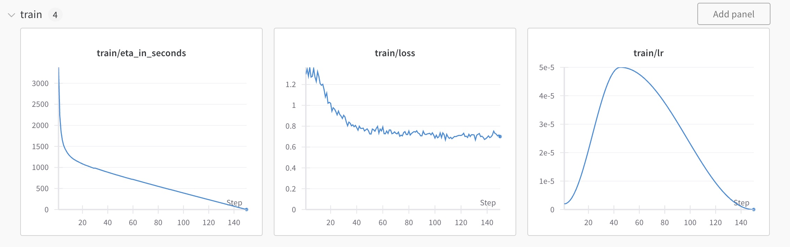
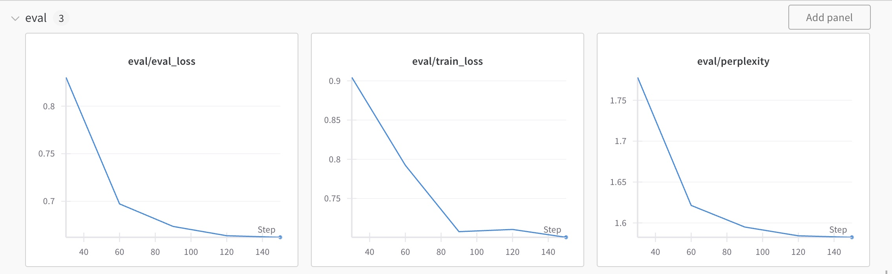

<a href="https://chat.vercel.ai/">
  <h1 align="center">🩺 SyDeTre - Symptom Detection and Treatment LLM </h1>
</a>

<p align="center">
  This is a submission for the <a href="https://mistral.ai/news/2024-ft-hackathon">mistral finetuning hackathon</a>, a Mistral fine-tuned model for symptom detection and treatment recommendations.
</p>

<p align="center">
  <a href="#features-✨"><strong>Features</strong></a> ·
  <a href="#dataset-and-model-training-📊"><strong>Dataset and Model Training</strong></a> ·
  <a href="#fine-tuning-process-🛠️"><strong>Fine-Tuning Process</strong></a> ·
  <a href="#wandb-results-📈"><strong>WandB Results</strong></a> ·
  <a href="#getting-started-🚀"><strong>Getting Started</strong></a> ·
  <a href="#license-📜"><strong>License</strong></a>
</p>

<br/>

## Why we chose this

When dealing with medical datasets you will notice that data related to drugs and medications for diseases are highly secretive. For this reason we decided to collect our own dataset with qna pairs about treating certain illnesses. 

## Features ✨

- 🩺 Symptom detection
- 💊 Treatment recommendations
- 📚 General medicine knowledge

## Dataset and Model Training 📊

The dataset used for fine-tuning SyDeTre is a combination of:
- Data generated by querying the Open Mixtral 8x22B model with questions about pharmaceutical drugs and illnesses.
- Various MIT license datasets related to medical information.

Below is the final Hugging Face dataset: [Hugging Face Dataset](https://huggingface.co/datasets/toniz/sydetre-72k-drugs-treatments/settings)

The fine-tuning process was conducted using the Mistral fine-tuning API.

## Fine-Tuning Process 🛠️

The fine-tuning process for SyDeTre involves using the Mistral fine-tuning API with a combination of generated and MIT license datasets. The `lib/finetuning/` folder includes all necessary scripts for replicating the fine-tuning process.

## WandB Results 📈

The fine-tuning results can be found here: 



## Getting Started 🚀

### Prerequisites

- Node.js (v14 or above)
- Yarn or npm

### Installation

1. Clone the repository:
    ```bash
    git clone https://github.com/yourusername/sydetre.git
    cd sydetre
    ```

2. Preparation and install dependencies:

    - Remove the `lib/finetuning` folder

    ```bash
    yarn install
    # or
    npm install
    ```

3. Set up environment variables:
    Create a `.env` file in the root directory and add the necessary configuration variables as in the .env.example.

4. Start the development server:
    ```bash
    yarn dev
    # or
    npm run dev
    ```

    The application will be available at `http://localhost:3000`.

## License 📜

This project is licensed under the MIT License.
